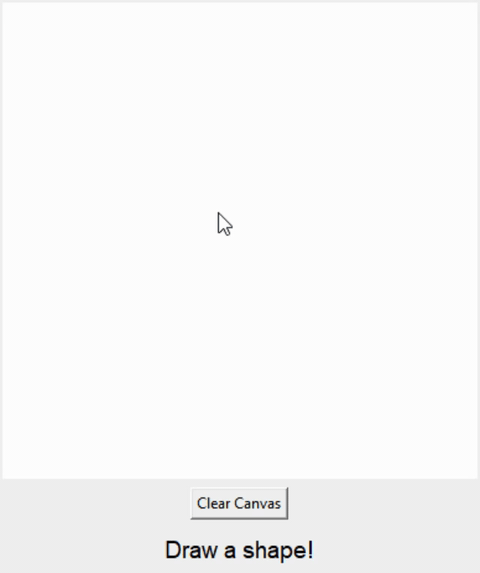
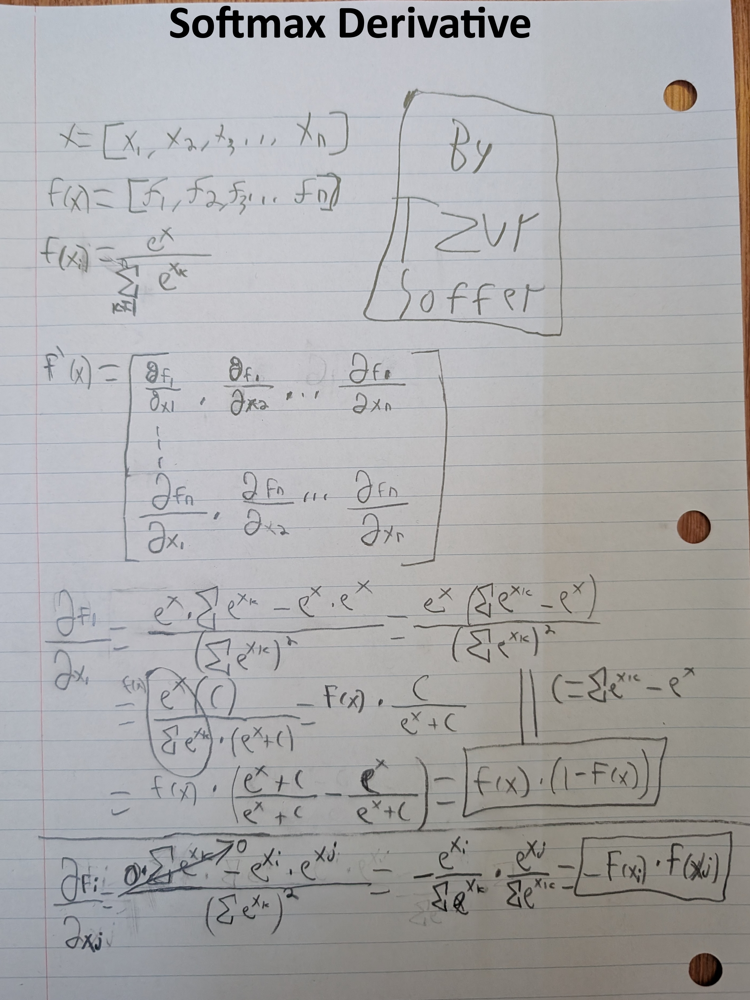
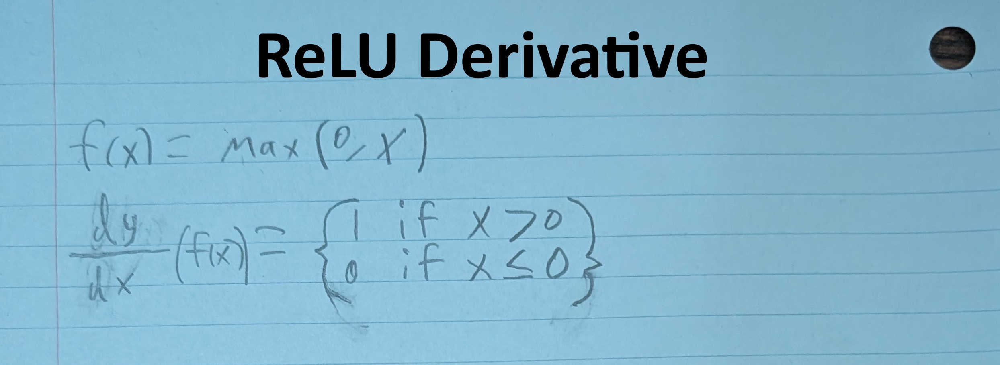
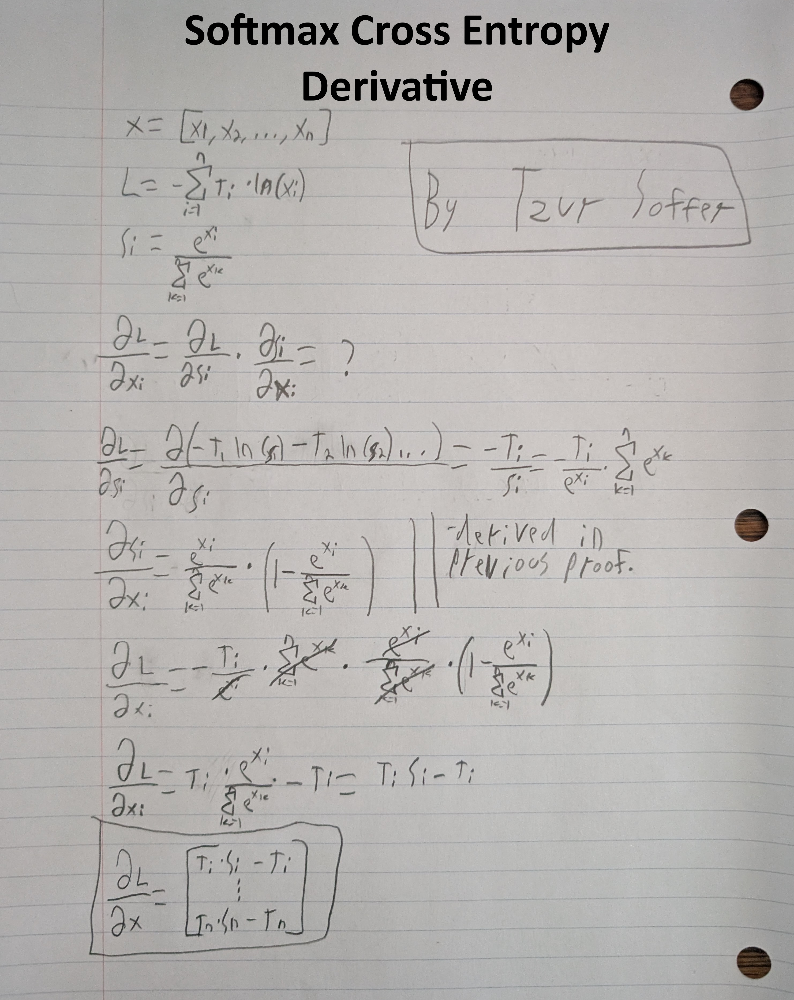
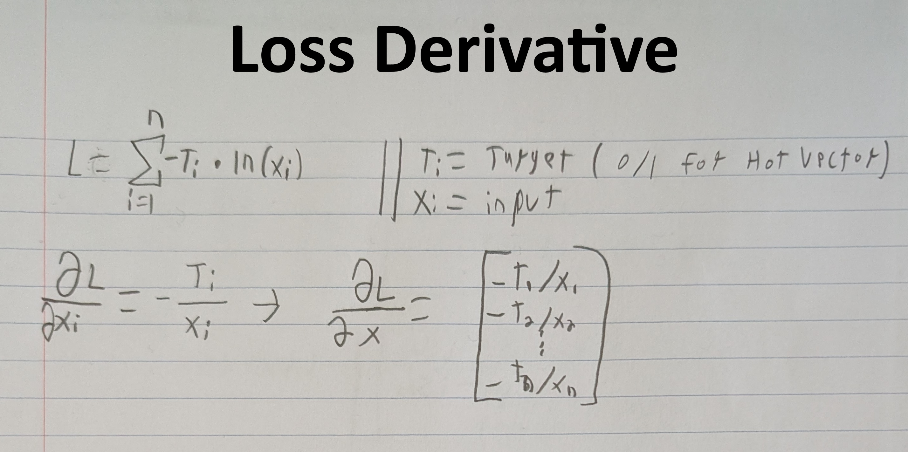
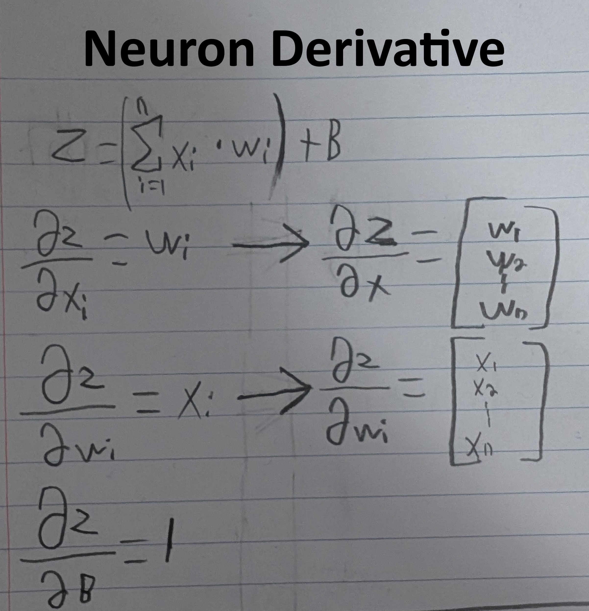

# Shape Classifier from Scratch

A lightweight, fully functional neural network engine written in **pure Python** as well as a neural network engine written in **pure C++** (no PyTorch, no TensorFlow, no NumPy). This project includes everything needed to train and run a fully functional custom Neural Network. I used this to then train a Neural Network that detects whether you draw a square or not. It mapped the image onto a 1D space using a **Hilbert Curve** (so that the resolution of the image would not force a full retraining of the Neural Network), then trains the network and saves it.
The network can be ran in pure python mode or as a hybrid python and C++ mode where most of the heavy lifting is done in C++ to drastically speed up training (21x speed).

---

# Overview

Modern deep learning frameworks hide much of the mathematics behind high-level APIs. That makes AI very hard to understand, so I decided to do it all from scratch. This project implements everything including all the math.

The network learns by repeatedly:

1. Receiving an input.
2. Producing predictions through forward propagation.
3. Measuring how wrong the prediction was.
4. Calculating gradients with backpropagation.
5. Adjusting weights and biases to improve future predictions.

After training, the resulting weights and biases can be saved.



---
# Activation Function Derivative proofs
<div style="gap: 10px;">
  
  
</div>

# Loss Derivative proofs
<div style="gap: 10px;">
  
  
</div>

# Neuron Derivative proofs
<div style="gap: 10px;">
  
</div>

---

# Why Build a Neural Network From Scratch?

Building a network without external libraries teaches me:

* Linear algebra
* Multi-variable calculus
* Backpropagation
* Optimization techniques
* Batch learning
* Activation functions
* C++

and teaches me how to properly use tensorflow/pytorch if I ever need to make a Neural Network.

---

# Features

### 100% From Scratch

Every part of the neural network is implemented manually using only Python and C++:

* Matrix operations
* Dense layers
* Batch processing
* Activation functions
* Softmax
* Cross-Entropy loss
* Backpropagation
* Gradient descent optimization
* Accuracy metrics

No machine learning libraries are used.

### C++ speed improvements

There are two `Mathlib`, `Layer`, `Activation`, and `Batch` that I built, one being in pure python and the other being made in C++. When using the C++ version, performance is much faster and it can help build complex neural networks much faster. However, it is is not required and the entire network can still run in only python.


---

# How Neural Networks Learn

A neural network consists of layers of neurons connected by weights.

Each neuron computes:

```
output = activation(weights · inputs + bias)
```

During training:

1. Inputs travel forward through the network.
2. Predictions are generated.
3. The prediction error is measured.
4. Gradients are computed using backpropagation.
5. Weights are adjusted to reduce error.

Over thousands of training iterations, the network slowly learns to recognize patterns.

---

### Custom Activation Functions

Several activation functions are implemented:

| Activation | Purpose                            |
| ---------- | ---------------------------------- |
| Pass       | Linear output                      |
| ReLU       | Removes negative values            |
| LeakyReLU  | Prevents dying neurons             |
| Softmax    | Converts logits into probabilities |

The classifier in the demo uses **LeakyReLU** in hidden layers to maintain gradient flow even when neuron outputs become negative.


---

# Forward Propagation

During Forward Propagation, each layer performs:

```
inputs
   ↓
weights × inputs + bias
   ↓
activation function
   ↓
next layer
```

The final output produces two scores:

```
[Square, Non-Square]
```

Softmax converts these scores into probabilities:

```
[0.97, 0.03]
```

indicating a 97% confidence that the image contains a square.

---

# Backpropagation

Training uses gradient descent and backpropagation.

Backpropagation applies the chain rule to determine how much every weight contributed to the prediction error.

The framework computes:

* Weight gradients
* Bias gradients
* Input gradients

and propagates these values backward through the network.

While the full jacobian derivative for Softmax is computed and can be used, because Softmax and Cross-Entropy are paired together, their derivatives simplify considerably. Of course, all of this is in the above proofs.

Instead of computing the full Jacobian matrix, the gradient becomes:
```
∂L/∂zi = (pi − ti)/N
```

where:

* `pi` is the predicted probability.
* `ti` is the target value.
* `N` is the batch size.

This greatly improves efficiency.

---

# Gradient Descent

Weights are updated according to:

```
Wnew = Wold − η∇WL
```

where:

* `η` is the learning rate.
* `∇WL` is the gradient of the loss with respect to the weights.

---

# Accuracy Metrics

Two accuracy systems are implemented.

### Hard Accuracy

Used for classification problems.

The predicted class is compared against the target class, producing:

* 1 for correct predictions.
* 0 for incorrect predictions.

---

### Soft Accuracy

Measures similarity between vectors using cosine similarity.

This is useful for regression tasks or probabilistic outputs.

# Demo System Architecture

The square detector demo uses a simple fully-connected network:

```
Input Image
      │
      ▼
Hilbert Curve Mapping
(32×32 = 1024 Features)
      │
      ▼
Hidden Layer
32 Neurons
LeakyReLU Activation
      │
      ▼
Output Layer
2 Neurons
(Logits)
      │
      ▼
Softmax
      │
      ▼
Probability Distribution

[Square, Not Square]
```

---

### Hilbert Curve Image Compression

In the square demo, instead of flattening images row-by-row, images are mapped into one-dimensional space using a **Hilbert Curve**.

This preserves spatial locality, meaning nearby pixels in 2D remain close together in 1D resulting in:

* Better feature preservation.
* Dense networks can recognize shapes more effectively.
* Image resolution can be increased without requiring an entirely different network structure.
* Neighboring pixels remain correlated, making learning easier.

---

This project is licensed under the MIT License, see LICENSE for more info.